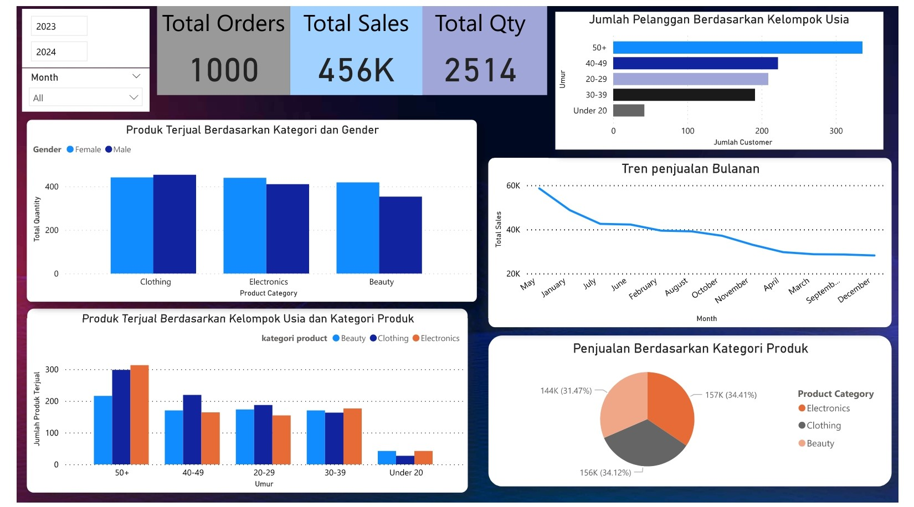

# 📊 Dashboard Analisis Penjualan Ritel


---

# 📌 Deskripsi Proyek

Proyek ini merupakan dashboard **Business Intelligence** yang dikembangkan menggunakan **Microsoft Power BI** untuk menganalisis performa penjualan ritel berdasarkan transaksi penjualan pelanggan.

Dashboard dirancang untuk membantu memahami pola penjualan, perilaku pelanggan, serta performa kategori produk melalui visualisasi data yang interaktif sehingga informasi bisnis dapat dipahami dengan lebih mudah.

Dataset yang digunakan merupakan **dataset penjualan ritel publik** yang diperoleh dari Kaggle "https://www.kaggle.com/datasets/mohammadtalib786/retail-sales-dataset".

---

# 🎯 Tujuan Analisis

Dashboard ini dibuat untuk membantu menjawab beberapa pertanyaan bisnis berikut.

### 📈 Analisis Kinerja Penjualan
- Berapa total nilai penjualan yang diperoleh?
- Berapa jumlah transaksi yang terjadi?
- Berapa total produk yang berhasil terjual?
- Bagaimana tren penjualan setiap bulan?
- Apakah terjadi peningkatan atau penurunan penjualan pada periode tertentu?

---

### 🛍️ Analisis Produk

- Kategori produk mana yang menghasilkan penjualan terbesar?
- Kategori produk mana yang paling banyak terjual?
- Bagaimana distribusi penjualan pada setiap kategori produk?

---

### 👨‍👩‍👧 Analisis Pelanggan

- Kelompok usia pelanggan mana yang melakukan pembelian paling banyak?
- Berapa jumlah pelanggan pada setiap kelompok usia?
- Produk apa yang paling banyak dibeli oleh pelanggan laki-laki?
- Produk apa yang paling banyak dibeli oleh pelanggan perempuan?
- Apakah terdapat perbedaan pola pembelian berdasarkan gender?

---

# 📊 Dashboard Overview

Dashboard terdiri dari beberapa komponen utama berikut.

## 🔹 KPI Cards

Menampilkan indikator utama penjualan berupa:

- Total Sales
- Total Orders
- Total Quantity

---

## 🔹 Filter Interaktif

Dashboard menyediakan filter agar pengguna dapat melakukan analisis berdasarkan:

- Tahun
- Bulan

---

## 🔹 Visualisasi

Dashboard menampilkan beberapa visualisasi utama berikut.

### 📈 Tren Penjualan Bulanan

Menampilkan perubahan total penjualan setiap bulan sehingga pengguna dapat mengetahui pola kenaikan maupun penurunan penjualan.

---

### 🛒 Penjualan Berdasarkan Kategori Produk

Menampilkan total penjualan pada setiap kategori produk untuk mengetahui kategori dengan performa terbaik.

---

### 👨 Produk Terjual Berdasarkan Gender

Membandingkan jumlah produk yang dibeli oleh pelanggan laki-laki dan perempuan pada setiap kategori produk.

---

### 👥 Produk Terjual Berdasarkan Kelompok Usia dan Kategori Produk

Menampilkan jumlah produk yang dibeli oleh setiap kelompok usia berdasarkan kategori produk sehingga dapat diketahui preferensi pembelian pada masing-masing kelompok umur.

---

### 👥 Jumlah Pelanggan Berdasarkan Kelompok Usia

Menampilkan distribusi jumlah pelanggan berdasarkan kelompok usia untuk mengetahui segmen pelanggan yang paling dominan.

---

# 🛠 Tools

- Microsoft Power BI
- Power Query
- DAX

---

# 📂 Dataset

**Sumber Dataset**

Kaggle

Dataset merupakan **public synthetic retail sales dataset** yang digunakan untuk pembelajaran analisis data menggunakan Power BI.

Dataset mencakup informasi mengenai:

- Transaction ID
- Date
- Customer ID
- Gender
- Age
- Product Category
- Quantity
- Price per Unit
- Total Amount

---

# 🖼 Dashboard

> Tambahkan screenshot dashboard di bawah ini.

```

```

atau cukup drag & drop gambar dashboard ke README GitHub.

---

# 📌 Insight yang Dapat Diperoleh

Dashboard ini dapat digunakan untuk memperoleh berbagai insight bisnis, antara lain:

✅ Mengetahui perkembangan penjualan dari waktu ke waktu.

✅ Mengidentifikasi kategori produk dengan kontribusi penjualan terbesar.

✅ Mengetahui kategori produk yang paling banyak dibeli pelanggan.

✅ Menganalisis pola pembelian berdasarkan gender pelanggan.

✅ Mengidentifikasi kelompok usia yang memiliki aktivitas pembelian tertinggi.

✅ Membandingkan preferensi kategori produk pada setiap kelompok usia.

✅ Memantau jumlah transaksi serta total produk yang berhasil terjual.

---

# 📈 Manfaat Dashboard

Dashboard ini dapat membantu proses pengambilan keputusan bisnis, seperti:

- Menentukan kategori produk yang perlu diprioritaskan.
- Menentukan target pemasaran berdasarkan kelompok usia pelanggan.
- Menentukan strategi promosi berdasarkan perilaku pembelian pelanggan.
- Memantau performa penjualan secara berkala.
- Mendukung proses monitoring penjualan secara interaktif.

---

# 📁 Struktur Project

```
Retail-Sales-Dashboard/
│
├── Dashboard.pbix
├── README.md
└── images
    └── dashboard.png
```

---

# 🚀 Hasil

Dashboard berhasil dikembangkan menggunakan Power BI dengan fitur:

- KPI Dashboard
- Interactive Filter
- Sales Trend Analysis
- Product Analysis
- Customer Analysis
- Business Insight Visualization

---

# 👩‍💻 Dibuat Oleh

**Rahma Nurhaliza**

Fresh Graduate Teknik Informatika

```

---

